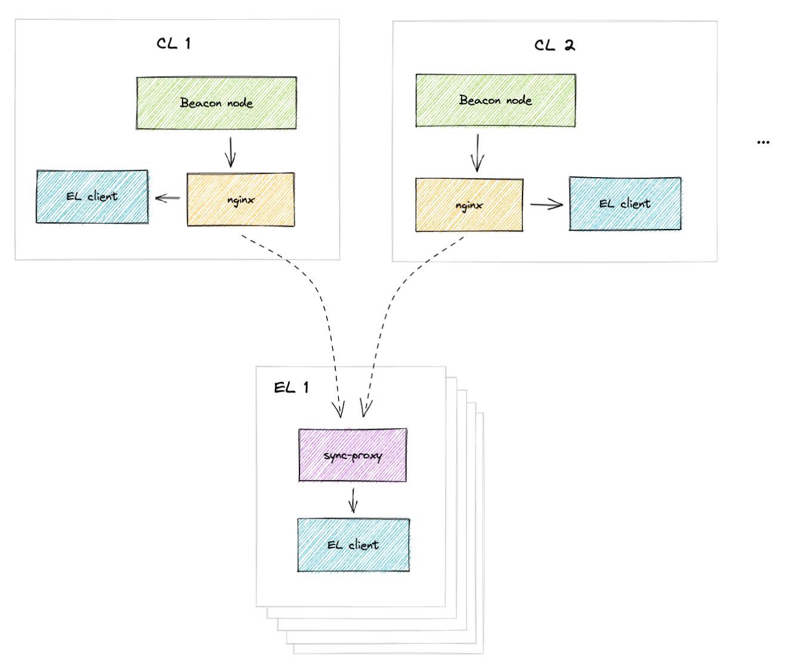

#

[](https://goreportcard.com/report/github.com/flashbots/sync-proxy)
[](https://github.com/flashbots/sync-proxy/actions?query=workflow%3A%22Checks%22)

Flashbots proxy to allow redundant execution client (EL) state sync post merge.

* Runs a proxy server that proxies requests from a beacon node (BN) to multiple other execution clients
* Can drive EL sync from multiple BNs for redundancy

## Getting Started

* Run a BN with the execution endpoint pointing to the proxy (default is `localhost:25590`). 
* Start the proxy with a flag specifying one or multiple EL endpoints (make sure to point to the authenticated port). 

```bash
git clone https://github.com/flashbots/sync-proxy.git
cd sync-proxy
make build

# Show the help
./sync-proxy -help
```

To run with multiple EL endpoins:

```
./sync-proxy -builders="localhost:8551,localhost:8552"
```

### Nginx

The sync proxy can also be used with nginx, with requests proxied from the beacon node to a local execution client and mirrored to multiple sync proxies.



An example nginx config like this can be run with the sync proxy:
<details>
<summary><code>/etc/nginx/conf.d/sync_proxy.conf</code></summary>

```ini
server {
        listen 8552;
        listen [::]:8552;

        server_name _;

        location / {
                mirror /sync_proxy_1;
                mirror /sync_proxy_2;
                mirror /sync_proxy_3;

                proxy_pass http://localhost:8551;
                proxy_set_header X-Real-IP $remote_addr;
                proxy_set_header Host $host;
                proxy_set_header Referer $http_referer;
                proxy_set_header X-Forwarded-For $proxy_add_x_forwarded_for;
        }

        #
        # execution nodes
        #
        location = /sync_proxy_1 {
                internal;
                proxy_pass http://sync-proxy-1.local:8552$request_uri;
                proxy_connect_timeout 100ms;
                proxy_read_timeout 100ms;
        }

        location = /sync_proxy_2 {
                internal;
                proxy_pass http://sync-proxy-2.local:8552$request_uri;
                proxy_connect_timeout 100ms;
                proxy_read_timeout 100ms;
        }

        location = /sync_proxy_3 {
                internal;
                proxy_pass http://sync-proxy-3.local:8552$request_uri;
                proxy_connect_timeout 100ms;
                proxy_read_timeout 100ms;
        }
```
</details>

## Caveats

The sync proxy attempts to sync to the beacon node with the highest timestamp in the `engine_forkchoiceUpdated` and `engine_newPayload` calls and forwards to the execution clients.

The sync proxy also attempts to identify the best beacon node based on the originating host of the request. If you are using the same host for multiple beacon nodes to sync the EL, the sync proxy won't be able to distinguish between the beacon nodes and will proxy all requests from the same host to the configured ELs.
